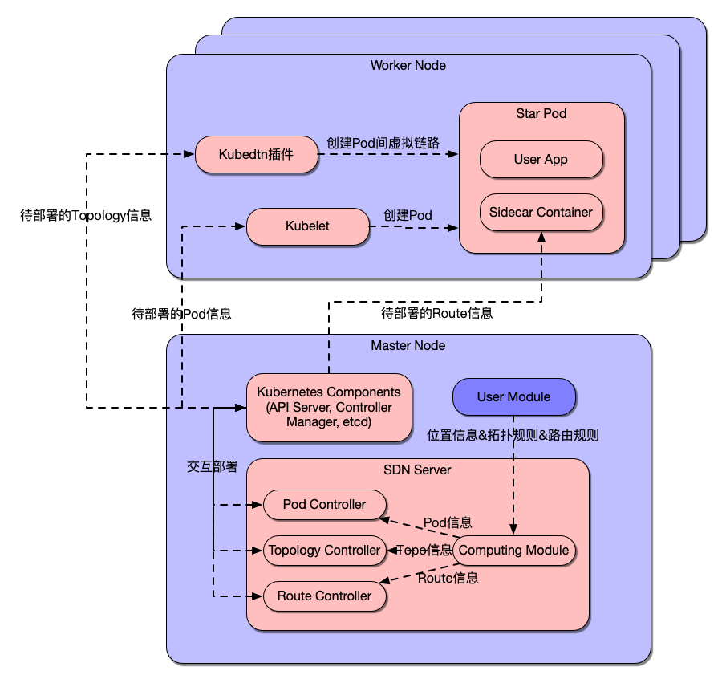

# Satellite-SDN
A SDN-style satellite network emulation system running on K8s cluster.

## Description
<div align="center">
    
</div>
<!--  -->

Satellite-SDN provides users with a CLI interface `sdnctl pos` to customize emulation environment (the typical input is a TLE file). Satellite-SDN builds a emulation env according to informations provided by User Module and updates env with timeout specified by the user.

## How it works

Satellite-SDN has 4 components:
1. SDN Server: `/sdn`
2. User Module: `/pos`
3. Route CRD Controller: `/controllers`
4. CLI Interface: `/cmd`

A **CNI plugin** like Cilium, Flannel is needed. Also, you should install [**kubedtn**](https://github.com/dtn-dslab/kube-dtn) to enable `Topology` Custom Resource, which is of great importance for our system.

And you should use our specified image `electronicwaste/podserver:<tag>` for route deployment.

### SDN Server

SDN server processes params from User Module and deploy `Pod`,`Topology`, `Route` to K8s cluster.

### User Module

Currently, User Module can only provide location information. You can specify TLE file, from which User Module will generate location informations, passing them to SDN Server.

**Build**: `make sdn`

**Run**: `./bin/sdnctl pos [FLAGS]`

### Route CRD Controller

This component aims to follow the Kubernetes [Operator pattern](https://kubernetes.io/docs/concepts/extend-kubernetes/operator/)

It uses [Controllers](https://kubernetes.io/docs/concepts/architecture/controller/) 
which provides a reconcile function responsible for synchronizing resources untile the desired state is reached on the cluster 

### CLI Interface

**Build**: `make sdn`

**Run**: `./bin/sdnctl init [FLAGS]`

## Deploy Route Controller
You’ll need a Kubernetes cluster to run against. You can use [KIND](https://sigs.k8s.io/kind) to get a local cluster for testing, or run against a remote cluster.
**Note:** Your controller will automatically use the current context in your kubeconfig file (i.e. whatever cluster `kubectl cluster-info` shows).

### Running on the cluster
1. Install Instances of Custom Resources:

```sh
kubectl apply -f config/samples/
```

2. Build and push your image to the location specified by `IMG`:
	
```sh
make docker-build docker-push IMG=<some-registry>/sdn-kubebuilder:tag
```
	
3. Deploy the controller to the cluster with the image specified by `IMG`:

```sh
make deploy IMG=<some-registry>/sdn-kubebuilder:tag
```

### Uninstall CRDs
To delete the CRDs from the cluster:

```sh
make uninstall
```

### Undeploy controller
UnDeploy the controller to the cluster:

```sh
make undeploy
```

## Contributing

Every new feature should have its own branch.

Use PR to merge your branch into main branch.

And commit comment should obey [git commit norm](https://zhuanlan.zhihu.com/p/182553920)


## License

Copyright 2023.

Licensed under the Apache License, Version 2.0 (the "License");
you may not use this file except in compliance with the License.
You may obtain a copy of the License at

    http://www.apache.org/licenses/LICENSE-2.0

Unless required by applicable law or agreed to in writing, software
distributed under the License is distributed on an "AS IS" BASIS,
WITHOUT WARRANTIES OR CONDITIONS OF ANY KIND, either express or implied.
See the License for the specific language governing permissions and
limitations under the License.

