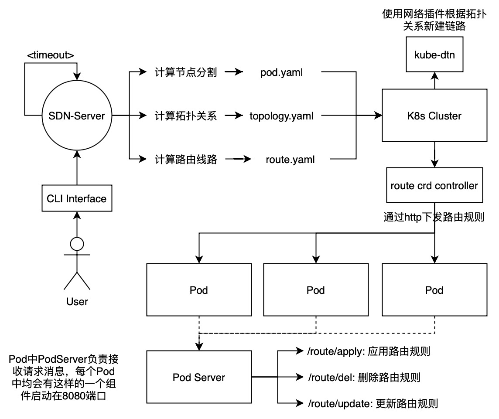

# Satellite-SDN
A SDN-style satellite network emulation system running on K8s cluster.

## Description


Satellite-SDN provides users with a CLI interface to customize emulation environment (the typical input is a TLE file). Satellite-SDN builds a emulation env according to satellite orbit described by TLE file and updates env with timeout specified by the user.

## Getting Started
You’ll need a Kubernetes cluster to run against. You can use [KIND](https://sigs.k8s.io/kind) to get a local cluster for testing, or run against a remote cluster.
**Note:** Your controller will automatically use the current context in your kubeconfig file (i.e. whatever cluster `kubectl cluster-info` shows).

### Running on the cluster
1. Install Instances of Custom Resources:

```sh
kubectl apply -f config/samples/
```

2. Build and push your image to the location specified by `IMG`:
	
```sh
make docker-build docker-push IMG=<some-registry>/sdn-kubebuilder:tag
```
	
3. Deploy the controller to the cluster with the image specified by `IMG`:

```sh
make deploy IMG=<some-registry>/sdn-kubebuilder:tag
```

### Uninstall CRDs
To delete the CRDs from the cluster:

```sh
make uninstall
```

### Undeploy controller
UnDeploy the controller to the cluster:

```sh
make undeploy
```

## Contributing

Every new feature should have its own branch.

Use PR to merge your branch into main branch.

And commit comment should obey [git commit norm](https://zhuanlan.zhihu.com/p/182553920)


### How it works

Satellite-SDN has 3 components:
1. SDN Server: `/sdn`
2. Route CRD Controller: `/controllers`
3. CLI Interface: `/cmd`


**SDN Server**

SDN server provides function call interfaces for CLI interfaces.

Two main APIs:
```
func RunSatelliteSDN(startParams) error;
func DelSatelliteSDN(endParams) error;
```

Http interface and grpc interface are being built now.

Https interface:
```
func CreateSDNHandler(w http.ResponseWriter, r *http.Request);
func UpdateSDNHandler(w http.ResponseWriter, r *http.Request);
func DelSDNHandler(w http.ResponseWriter, r *http.Request);
```

**Route CRD Controller**

This component aims to follow the Kubernetes [Operator pattern](https://kubernetes.io/docs/concepts/extend-kubernetes/operator/)

It uses [Controllers](https://kubernetes.io/docs/concepts/architecture/controller/) 
which provides a reconcile function responsible for synchronizing resources untile the desired state is reached on the cluster 

**CLI Interface**

**Build**: `make sdn`

**Run**: `./bin/sdnctl init [FLAGS]`

### Test It Out
1. Install the CRDs into the cluster:

```sh
make install
```

2. Run your controller (this will run in the foreground, so switch to a new terminal if you want to leave it running):

```sh
make run
```

**NOTE:** You can also run this in one step by running: `make install run`

### Modifying the API definitions
If you are editing the API definitions, generate the manifests such as CRs or CRDs using:

```sh
make manifests
```

**NOTE:** Run `make --help` for more information on all potential `make` targets

More information can be found via the [Kubebuilder Documentation](https://book.kubebuilder.io/introduction.html)

## License

Copyright 2023.

Licensed under the Apache License, Version 2.0 (the "License");
you may not use this file except in compliance with the License.
You may obtain a copy of the License at

    http://www.apache.org/licenses/LICENSE-2.0

Unless required by applicable law or agreed to in writing, software
distributed under the License is distributed on an "AS IS" BASIS,
WITHOUT WARRANTIES OR CONDITIONS OF ANY KIND, either express or implied.
See the License for the specific language governing permissions and
limitations under the License.

